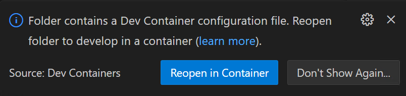
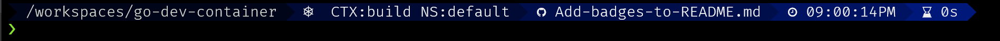

<!--cspell:ignore sarg trivy gitui kubectx Fira Firacode Caskaydia Consolas   -->
# Go Dev Container

[](https://scorecard.dev/viewer/?uri=github.com/sarg3nt/go-dev-container)
[](https://github.com/sarg3nt/go-dev-container/actions/workflows/scorecard.yml)
[](https://github.com/sarg3nt/go-dev-container/actions/workflows/trivy.yml)
[](https://github.com/sarg3nt/go-dev-container/actions/workflows/dependabot/dependabot-updates)
[](https://github.com/sarg3nt/go-dev-container/actions/workflows/dependency-review.yml)
[](https://github.com/sarg3nt/go-dev-container/actions/workflows/release.yml)

A Go Dev Container using `mise` to install Go and other convenient tools.  
`mise` can then be used to install various other Go versions as needed.

- [Included Tools](#included-tools)
  - [Go](#go)
  - [Utilities](#utilities)
- [Using `mise` to Manage Go Versions](#using-mise-to-manage-go-versions)
- [Included `.devcontainer` Config](#included-devcontainer-config)
  - [Dev Container Setup](#dev-container-setup)
  - [`dev.sh`](#devsh)
- [Starship](#starship)
- [Initial Worksation Setup](#initial-worksation-setup)
  - [WSL on Windows](#wsl-on-windows)
  - [Windows Font Install](#windows-font-install)
    - [Windows Terminal Font Setup](#windows-terminal-font-setup)
  - [Linux Font Install](#linux-font-install)
  - [Visual Studio Code Font Setup](#visual-studio-code-font-setup)
- [Contributions](#contributions)
- [Author](#author)


## Included Tools

See the base `mise` config file at `home/vscode/.config/mise/config.toml` for all tools and versions.

### Go
- golang
- golangci-lint
- goreleaser

### Utilities
- bat
- fzf
- gitui
- helm
- k9s
- kubectl
- kubectx
- lsd
- starship
- yq

## Using `mise` to Manage Go Versions

1. Copy the `.mise.toml` file from the root of this repo to your project's root and modify it as needed.
1. The provided `.devcontainer` will automatically call `mise install` to install the custom versions of the applications.
1. After the container is started and you exec into it, `mise` will automatically install the app versions listed in the `.mise.toml` file.
1. Other applications can also be installed by editing the `.mise.toml` file.  
  Run `mise help` for examples.

## Included `.devcontainer` Config

This repository also includes an example on how to use the built Go dev container.

Do the following to use this example.

1. Clone down the repository.  
   `git clone https://github.com/sarg3nt/go-dev-container.git`
2. Ensure your target project does not already have a `.devcontainer` directory.  If it does, you will either need to rename it for testing or delete it.
3. Copy the `.devcontainer` directory to your project.
4. Copy the following files to the root of your project.  
   These are optional but encouraged.
    - `.mise.toml`:  The config file for manageing specific versions of tooling you need for your Go project.
    - `cspell.json`:  The cspell config for spell checking in your project, edit to add any specific words that your project needs.
    - `dev.sh`:  Helps launch VSCode and exec into the dev container.  This file needs some modification to use in your repository.  See [dev.sh](#devsh) for instructions.

We've included an `install.sh` script to automate the process of copying the above files into your project directory.  

The script must be ran from the root of the `go-dev-container` project.  

**Example:**  `./install.sh ~/src/my-go-project`

### Dev Container Setup

Once you've followed the above instructions to copy the needed files to your project, perform the following to configure them.

Edit the `devcontainer.json` file to make the following changes.

- Change `name` from `go-dev-container` to the name of your project.
- Change `--name` in `runargs` from `go-dev-container` to the name  of your project.
- Change `source=go-dev-container-bashhistory` to `source=<YOUR-PROJECT>-bashhistory`
- Change `source=go-dev-container-plugins` to `source=<YOUR-PROJECT>-plugins`

> **NOTE:** You may be tempted to find and replace `go-dev-container` with the name of your project, however the `image` for the container is called `go-dev-container` so that would break things.  If you want to do a controlled replacement you can, just be careful not to replace that one line.

### `dev.sh`

This script is used to easily start VSCode and exec into the Dev Container from the terminal that it is ran from.  This frees the developer from having to use the VSCode integrated terminal.  

You can run `dev.sh` in multiple terminals once VSCode is running and the container has started to easily exec into it.

- Open the `dev.sh` file and set a `docker_exec_command` if desired, this is optional but if this repo is used a lot, it is a nice to have.  This will create a command in the users `.bashrc` and `.zshrc` to quickly exec into this running dev container.
- Change `project_name` to match the name of the repository.  
  **Example:** If your root project repository is called `my-go-project` then set `project_name` to `my-go-project`

To use the `./dev.sh` script, simply run it, then when VS Code opens, there should be a prompt at the bottom right of the editor saying "Folder contains a Dev Container . . .".  Click the "Reopen in Container" button and VS Code will open the dev container and attach to it.



> **NOTE:** If you have not opened the dev container before or if it has been updated it will download the container from Github, which can take a while.

## Starship 

Starship is a custom Power Line command prompt we include.



For Starship to function properly you need a [Nerd Font](https://www.nerdfonts.com/) installed from [Nerd Fonts Downloads](https://www.nerdfonts.com/font-downloads).

See [Initial Worksation Setup](#initial-worksation-setup) for instructions on downloading and installing the fonts.

## Initial Worksation Setup

Instructions to set up your worksation.
For more information on Dev Containers check out the [official docs](https://code.visualstudio.com/docs/devcontainers/containers).

### WSL on Windows

1. If you will be building Docker containers in Windows, then install Docker Desktop for Windows following [Docker's instructions](https://docs.docker.com/desktop/install/windows-install/).  If you do not need Docker for Windows support then you can [directly install Docker inside of Ubuntu](https://docs.docker.com/engine/install/ubuntu/) **AFTER** you install WSL and Ubuntu in the following steps. 
1. Install VS Code from the [Visual Studio Code website](https://code.visualstudio.com/download) or from the Microsoft Store.
1. Open VS Code and click on the "Extensions" button to the left.  
   1. Search for "Dev Containers" and install it.
   1. Search for "WSL" and install it.
1. WSL is the Windows Subsystem for Linux and facilitates the use of a Linux distruction on Windows.  
Follow the [Microsoft insructions](https://learn.microsoft.com/en-us/windows/wsl/install) to install WSL and a Linux distribution.  Ubuntu is probably the most commong Linux OS used in WSL, but feel free to choose what you want.  Note that the dev container itself uses Rocky Linux but this shouldn't matter to you during use.

### Windows Font Install

To get the full functionality of font ligatures and icons for the Starship prompt you will need to install a [Nerd Font](https://www.nerdfonts.com/) from [Nerd Fonts Downloads](https://www.nerdfonts.com/font-downloads).  If you skip this step the Dev Container terminal command line will look weird and not have icons thus making it harder to read.

Many of us use [FiraCode Nerd Font](https://github.com/ryanoasis/nerd-fonts/releases/download/v3.0.2/FiraCode.zip) or [FiraMono Nerd Font](https://github.com/ryanoasis/nerd-fonts/releases/download/v3.0.2/FiraMono.zip) but you can [preview](https://www.programmingfonts.org/#firacode) any of the fonts and choose which one is best for you.

Download your chosen font and [install it in Windows](https://support.microsoft.com/en-us/office/add-a-font-b7c5f17c-4426-4b53-967f-455339c564c1) then proceed to the next step.

#### Windows Terminal Font Setup

1. Open Windows Terminal, select the menu chevron to the right of the last tab and select settings.
1. On the left select `Profiles` --> `Defaults`
1. Under `Additional Settings` select `Appearance`
1. Under `Font Face` select the name of the font you downloaded, for example if you chose the "Firacode Nerd Font" then you'd choose `Firacode NF`  You may need to check `Show all items` or restart Windows Terminal to see the new fonts.

### Linux Font Install

See [How to Install New (or Nerd) Fonts on Linux (Ultimate Guide)](https://linuxtldr.com/install-fonts-on-linux/) for instructions.

### Visual Studio Code Font Setup

The fonts must be installed in your operating system to be used in VSCode.  If you are running VSCode on Windows and using it in Linux inside of WSL you would still install the fonts in Windows.

1. Select `File` --> `Preferences` --> `Settings`
1. Expand `Text Editor` --> select `Font`
1. In the `Font Family` text box paste the following:  

    > **NOTE:** This assumes you chose "FiraCode NF", if not, replace the first font name with the name of the font you installed in Windows.

   ```
   'FiraCode NF', 'CaskaydiaCove NF', Consolas, 'Courier New', monospace
   ```

## Contributions

Contributions are welcome via the standard Github Fork --> PR process.

## Author

David Sargent
- dave [at] sarg3.net
- GitHub at [sarg3nt](https://github.com/sarg3nt)
